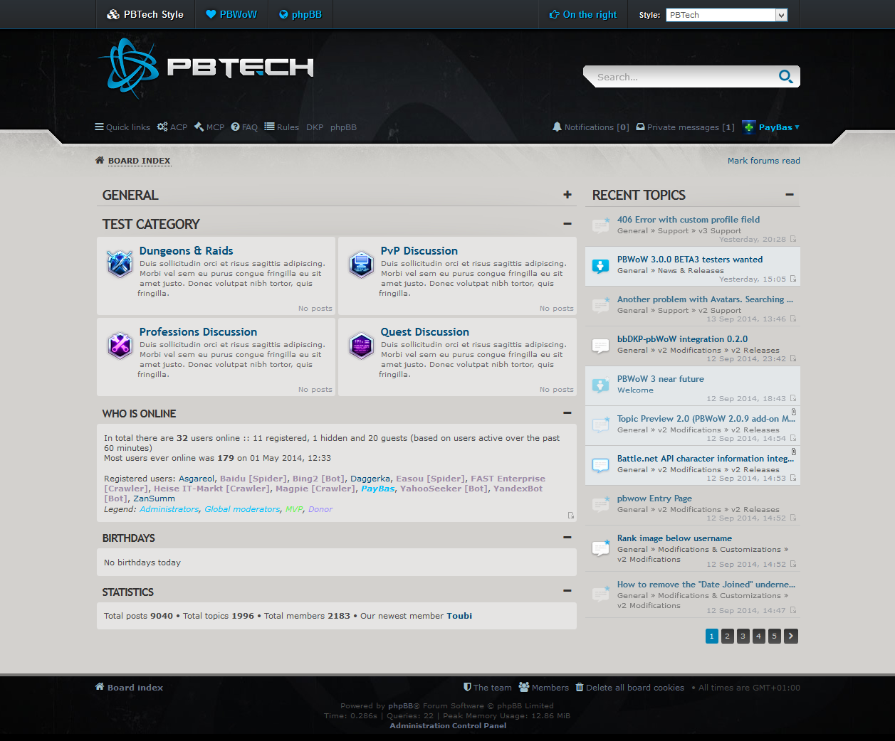

PBTech Style for phpBB 3.1.9
============



This style was inspired by the Battlenet forums 2015. example
http://web.archive.org/web/20141207163104/http://us.battle.net/en/forum/topic/10423582376

#### Requirements
- phpBB 3.1.x
- prosilver 3.1.x

#### Important notes
- prosilver needs to be installed. PBTech should inherit from it (as a child of prosilver, check your ACP to be sure).
- To add the sidebar with "Recent Topics" on the index, please install my [Recent Topics extension] (https://www.phpbb.com/community/viewtopic.php?f=456&t=2236571).
- To change the links/content of the top-bar, you can edit `styles/pbtech/template/top_bar.html` (to change the icons, please read the "Customization" section below).
- To add special styling for certain user groups (admins, donors, etc.), use my [Rank Post Styling extension] (https://www.phpbb.com/community/viewtopic.php?f=456&t=2251646).
  - Available predefined classes are: "blizz", "mvp", and "propass" (you can change these by editing `custom.css` (see below)).
- To add icons for the phpBB Pages extension, see below.

#### Customizing
If you want to change the logo, the top-bar icons, or post-styles, you can find what you need in:
`styles/pbtech/theme/custom.css`

Here you will find some styling rules that you can play around with. Most of it is pretty easy, except perhaps the FontAwesome icons.

FontAwesome icons are defined by using their unicode values, like `\f004`. You can add your own rules for your own icons, or change the existing codes. The quickest way to find the unicodes you need is to use the [FontAwesome cheatsheet] (http://fontawesome.io/cheatsheet/). You need to copy the last 4 characters of the code string after the icon you want, and prefix it with a `\`. So "home" is `\f015`.

You can use this method to add icons to just about every element. A commonly used example is for the phpBB Pages extension, when you want to assign icons to your page links (in the header/footer/etc). Add the following code to your `custom.css` file:
````
.small-icon.icon-page-xxx > a:before { content: '\f0ac'; }
````
Change the `xxx` to the "route" of your custom page

### Support

For more information and support, we suggest you visit 
- [PBWoW.com] (http://pbwow.com/forum/) (is down)
- [avathar.be] (http://www.avathar.be/bbdkp/viewforum.php?f=82)  

### Changes

3.0.8.1 (26-6-2016)
- new design for Polls
- new design for Top bar
- new design for Rules
- changed colors for Bbcode code box
- updated Fontawesome to 4.6
- fix for Recent topics

3.0.8 (12-6-2016)
- updated for phpbb 3.1.9
- updated for Recent Topics v2.1

3.0.7 (05-3-2016)
- updated for phpbb 3.1.8

3.0.6 (05-3-2016)
- updated for phpbb 3.1.7

3.0.5 (05-3-2016)
- updated for phpbb 3.1.6

### License
[GNU General Public License v2](http://opensource.org/licenses/GPL-2.0)

© 2014 - PayBas
